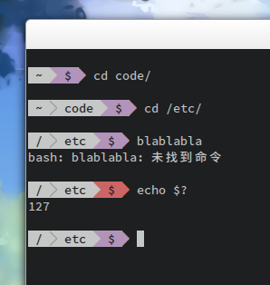

# Powerline-bash



## Usage

Add this to your `~/.bashrc`:

```
function _powerline() {
   export PS1="$(~/bin/powerline-bash/powerline.sh $? 2> /dev/null)"
}

export PROMPT_COMMAND="_powerline; $PROMPT_COMMAND"
```
